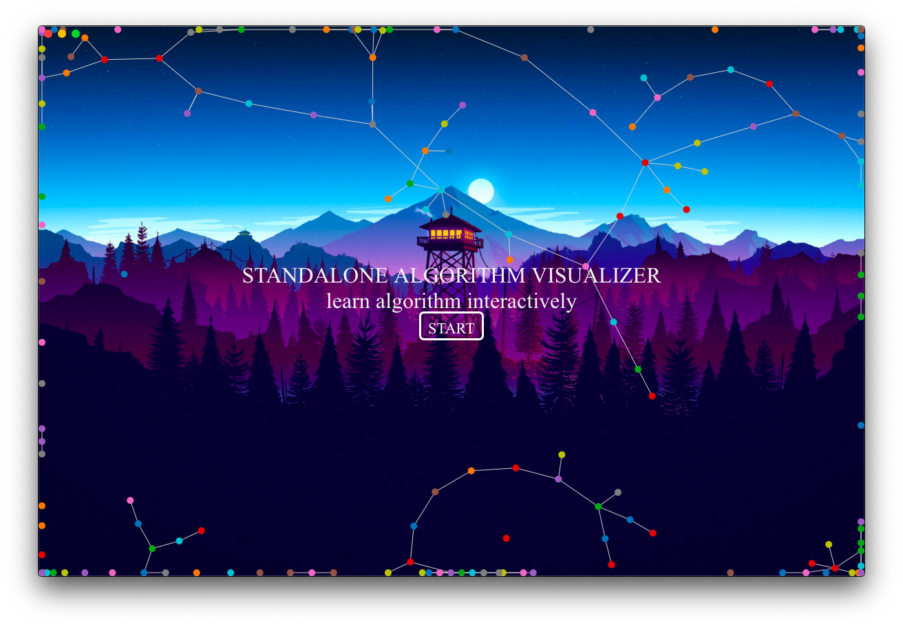

# Standalone Algorithm Visualizer

## Builds

> `The power of the unaided mind is highly overrated… The real powers come from devising external aids that enhance cognitive abilities.`- [Donald Norman](https://jnd.org/things-that-make-us-smart-defending-human-attributes-in-the-age-of-the-machine/)

**Standalone Algorithm Visualizer** is the standalone app which is build for `Mac`, `Windows` and `Linux OS` and is build on `Javascript` and [electron](https://github.com/electron/electron) And yes it is an open-source and will always be. It gives you a playground to learn while you play with algorithm and its theory. It makes mathematical expression and theorm easy to understand.

> Download latest [release](https://github.com/omkarnath1123/standalone-algorithm-visualizer/releases) to run app on your local machine.

> Note: The project is still expanding. New units are added and existing ones modified from time to time.

### Uses

- this app tries coveres (adding conten) the theoretical and practical aspects of algorithms.
- movable and draggable interface make algorithms even more easier to understand.
- algorithm theorem are now more even easier to undestand.

## Fequently asked questions

**Question** : Is it free ?

**Answer** : Yes, it is free and always will be. It is also an open-source project.

**Question** : what is the Difficulty level?

**Answer** : Easy. Visuals make it even easier.

**Question** : How to setup app locally?

**Answer** : Easy. Just download the latest release for your system.

- for Windows download and run .exe
- for Mac download and run .dmg
- for Linux download and run .deb

**Question** : Is there any pre-requisites ?

**Answer** : Very basic set of theoretical knowledge might be useful, but not required.

**Question** : Is any certificate provided ?

**Answer** : Sorry, no certificates. It's just you and the material.

> Help the project reach more people. Share this app with your friends and colleagues. Spread the word :exclamation: :exclamation:
